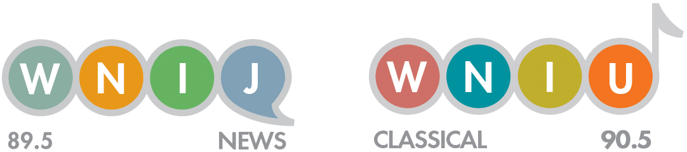

# Project02 - WNIJ Partnership Project
## Illinois College & University Enrollment Trends

## Project Description 
Since 2010, total enrollment at Illinois colleges and universities has dropped by more than 150,000 students. [Illinois has also lost more students](https://www.sj-r.com/news/20170930/getting-out-many-students-leaving-illinois-to-attend-college) to out-of-state colleges than nearly any other state. 

This year, Illinois lawmakers are finally [beginning to address the situation](https://www.chicagotribune.com/news/ct-met-illinois-students-public-universities-20180824-story.html). They’ve passed several bills to try to convince students to stay. But as they rush to clean up the mess, we want to figure out who these students are. 

What does enrollment look like based on race or gender? And how have those numbers changed in the last few years? What sorts of institutions are growing and shrinking (community colleges, public universities, private non-profits)? How much financial aid is given out and to who? And finally, for those students who are leaving the state -- where are they going? That’s the sort of thing we want to explore and visualize here. 

## Potential Resources:

- Major source of data Illinois Board of Higher Education’s [Data Book](http://legacy.ibhe.org/IBHEDatabook/default.aspx)
	- [Table 1: Characteristics of Enrollment in Illinois Colleges and Universities](http://legacy.ibhe.org/IBHEDatabook/ChapterI/Table I-1.aspx)
	- [Table 2: Total Fall Enrollments by Gender, Race, or National Origin, and Type of Institution, and Level of Institution](http://legacy.ibhe.org/IBHEDatabook/ChapterI/Table I-2.aspx)
	- [Table 3: Race or National Origin of Students Enrolled in Illinois Colleges and Universities by Type of Institution](http://legacy.ibhe.org/IBHEDatabook/ChapterI/Table I-3.aspx)
	- [Table 8: Home State of First-Time Freshman Students Enrolled in Illinois Colleges and Universities, by Type of Institution](http://legacy.ibhe.org/IBHEDatabook/ChapterI/Table I-8.aspx)
	- [Table 9: Illinois Residents as First-Time Students Attending Out-of-State Institutions](http://legacy.ibhe.org/IBHEDatabook/ChapterI/Table I-9.aspx)
- Not available on Data Book site is financial aid data which is available via [spreadsheet](http://bit.ly/csci627-project02)

- WNIJ and WNIU Logo Colors in RGB format
	- W: 138, 174, 162
	- N: 232, 152, 24
	- I: 102, 180, 97
	- J: 128, 161, 182
	- W: 206, 112, 103
	- N: 0, 146, 159
	- I: 191, 174, 44
	- U: 244, 116, 33

## Learning Outcomes
- The process of collecting and organizing data.
- Evaluation data and benefits of prototyping in visualization.
- Application of visualization best practices.
- How to receive and react to customer feedback.

# Class Project Requirements

There are multiple required components to the project and described in more detail below. 

- Project Prototypes [40%], sketches and prototypes for display to WNIJ team
- Project Execution [50%], final web/publication quality visualizations for WNIJ team
- Project Report [10%], final report on project (details below)

This project focuses on delivering high quality visualizations driven by customer requirements. Students are expected to respond to feedback/comments/suggestions as they move from prototype/preview stage to final material.  These feedback/comments/suggestions should be noted, as well as approach taken in addressing them in final report. Report should also cover lessons learned, what worked and didn't worked and overall view on project experience.

Each student has been assigned an **objective** to work on for this project:

- **OBJECTIVE #1** *Enrollment Based on Type of Institution* (Table 2): What types of schools are Illinois students going to more or less compared to past. Enrollment itself has been consistently down since 2010, but which institutions are hit the hardest? Community colleges and public universities have struggled since the budget impasse, but what about private-non or for profits? Illustrate these numbers and how they’ve changed since 2010. All of those years of data are available on the website. 

- **OBJECTIVE #2** *Enrollment Based on Race and Gender* (Table 3): Look at the demographics of Illinois’ students, and how that has shifted. Sort by race or gender demographics based on the types of institutions. Look at the trends in total enrollment when it comes to race and gender. For example, how many African American women are going to Illinois colleges now as opposed to in 2010? All of those years of data are available on the website.

- **OBJECTIVE #3** *Financial Aid: Scholarships, Loans and Grants* (Spreadsheet): Look at who is getting the majority of financial aid, whether they be students at public universities and colleges or private-non or for profits. What kind of financial aid, how much they’re getting and how that amount of money has changed as enrollment has fallen. Questions to explore include - How the financial aid money has fluctuated in the past five years?
There are a lot of categories of financial aid in this spreadsheet, try and narrow focus to maybe a half dozen to a dozen:
	- Suggestion: Sort them by 1.) Public; 2.) Public, 2-year; 3.) Private not-for-profit, 4-year or above and 4.) Private for-profit, less-than 2-year

		-	The number of first-time full-time undergraduates awarded any financial aid (column H)
		-	Total amount and percent of federal, state, local or institutional grant aid awarded to full-time first-time undergraduates. (columns M-N) 
		-	Total amount of federal grant aid awarded to full-time first-time undergraduates, and percent of students receiving it. (Q-R) 
		-	Total amount of Pell grant aid awarded to full-time first-time undergraduates, and percent of students receiving it. (U-V)
		-	Total amount of state/local grant aid awarded to full-time first-time undergraduates, and percent of students receiving it. (AC-AD) 
		-	Total amount of institutional grant aid awarded to full-time first-time undergraduates, and percent of students receiving it. (AG-AH)
		-	Total amount of student loans awarded to full-time first-time undergraduates, and average amount of those loans. (AL-AM)
		-	Total amount of federal student loans awarded to full-time first-time undergraduates, and average amount of those loans. (AP-AQ)

- **OBJECTIVE #4** *Illinois Students Enrolling In Out-of-State Institutions as First-Time Students, and Vice-Versa* (Table 8 and 9): Interested in looking at the students who are leaving and the ones coming in. What is the disparity between those numbers? How many more students are leaving Illinois to go to school now than they were in 2010? As for the students leaving, what states are they going to? Are they going to particular schools within those states?

## Project Prototypes (includes data collection) [40%]
This project focuses on delivering high quality visualizations driven by customer requirements. Students will be given access to the customers via Slack and during one in class session to present ideas and seek feedback.  Receiving feedback and acting on it is very important and should be captured in project report. You can make your prototypes in both your class notebook (one used for project00) and in digital form.  Please put your digital prototypes in the prototypes directory. Paper notebook will be collected towards the end of the semester.

## Project Execution [50%] 
This project focuses on delivering high quality visualizations driven by customer requirements. Students are expected to respond to feedback/comments/suggestions as they move from prototype/preview stage to final material.  Final form should be visualizations suitable for display on WNIJ website, this include web friendly colors, format and appropriate sizes.  Your final image should be named as follows: the number of the objective you were assigned followed by your ZId with appropriate file type extension. For example, if I was assigned to objective 1 and saved my file in png format my filename would be `1z123456.png`.

## Project Report [10%] 
You will write a project report, this report need not be long but should answer questions such as:

- What did you learn as part of this project?
- How did the prototyping help you?
- How did you address feedback/suggestions from the customer?
- What would you do different the next time?
- What was the biggest challenge in this project? 

This can be as short as one paragraph to as long as one page and you must use good grammar and spelling.

